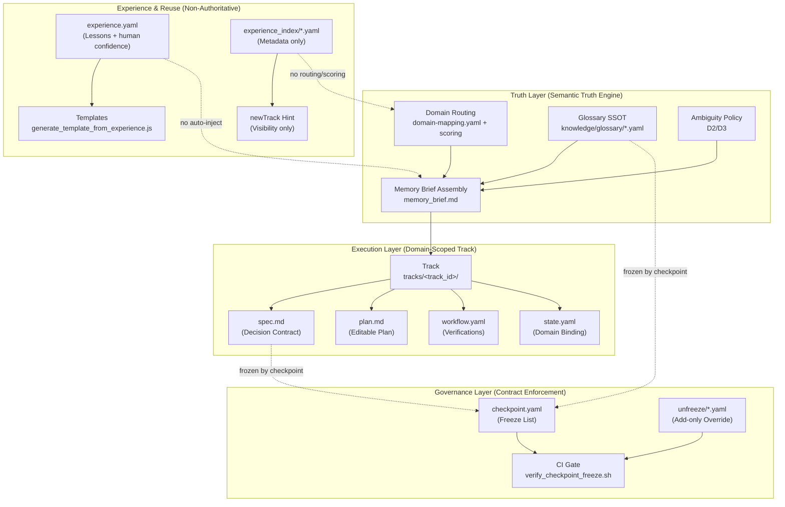

# LiYe OS Core (STABLE)

LiYe OS Core is the **stable kernel** that makes AI work **trackable, auditable, and governable**.

It enforces four non-negotiable principles:

- **Track is an execution container, not a knowledge base.**
- **Memory is semantic truth, not a process engine.**
- **Experience is visibility, not authority.**
- **Checkpoint freeze enforces responsibility, not correctness.**

---

## Architecture Overview

---

## Quick Start (New Track)

1. Create a new Track:
   - `liye track new "<task>"`

2. If an experience hint appears, optionally review:
   - `tracks/<track_id>/experience.yaml`

3. Fill in `spec.md` and `plan.md`, then run execution + verification per your workflow.
   - Freeze `spec.md` + glossary via `checkpoint.yaml` when the decision is ready to become a contract.

---

## Key Documents

| Document | Purpose |
|----------|---------|
| [LIYE_OS_CORE_STABLE_SPEC.md](./architecture/LIYE_OS_CORE_STABLE_SPEC.md) | Full specification (v1.0) |
| [CORE_STATUS.md](./architecture/CORE_STATUS.md) | Stability indicator |
| [CORE_CHANGE_POLICY.md](./governance/CORE_CHANGE_POLICY.md) | High-risk change rules |

---

## Operating Principle

> **Core is stable. Growth happens through new tracks, not kernel rewrites.**
