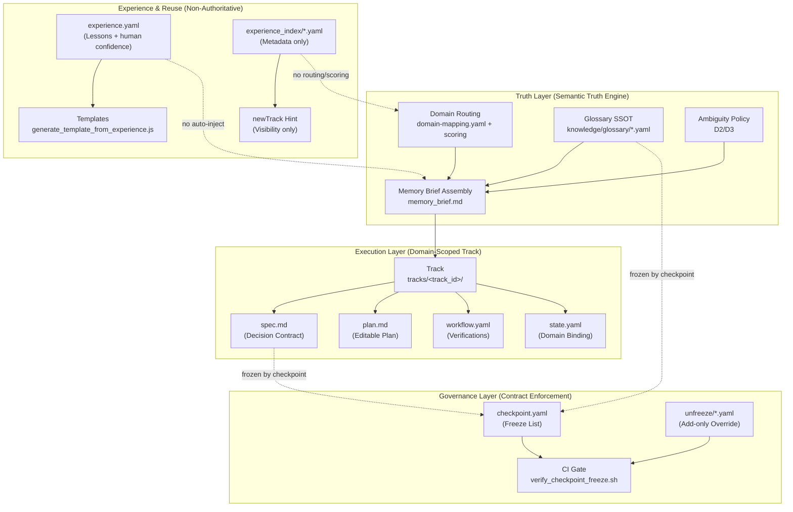

# LiYe AI / LiYe OS Architecture Constitution

> **Version**: 3.2
> **Status**: FROZEN - No modifications allowed without governance review
> **Date**: 2025-12-27
> **Brand**: LiYe AI (product) / LiYe OS (technical kernel)

---

## 1. Core Architecture: Four-Layer Model

```
LiYe OS Four-Layer Architecture (Tri-Fork Fusion)
┌─────────────────────────────────────────────────────────────┐
│ ① LiYe Method Layer   (WHY)  ← inspired by BMad Method     │
│    - Phase/Stage definitions                                │
│    - Agent Persona declarations (YAML)                      │
│    - Workflow DSL definitions                               │
│    - Track Rules (Quick/Standard/Enterprise)                │
│    - Evolution Protocol definitions                         │
│    【DECLARATION ONLY - No execution code】                 │
├─────────────────────────────────────────────────────────────┤
│ ② LiYe Runtime Layer  (HOW)  ← wraps CrewAI (pip dep)       │
│    - Agent Executor (runtime shell)                         │
│    - Task Scheduler (DAG)                                   │
│    - Process Manager (Sequential/Parallel)                  │
│    - Memory Manager (context passing)                       │
│    - Evolution Engine (executes protocol)                   │
│    【EXECUTION ONLY - No business semantics】               │
├─────────────────────────────────────────────────────────────┤
│ ③ LiYe Skill Layer    (WHAT) ← inspired by Skill Forge      │
│    - Atomic Skills (single capability)                      │
│    - Composite Skills (skill chains)                        │
│    - Skill Registry                                         │
│    - Skill Loader                                           │
│    - Skill Validator                                        │
│    【CAPABILITY ONLY - No Agent/Flow concepts】             │
├─────────────────────────────────────────────────────────────┤
│ ④ LiYe Domain Layer   (WHERE) ← LiYe Original               │
│    - amazon-growth/ (9 Agents)                              │
│    - medical-research/                                      │
│    - geo-os/                                                │
│    - custom-domain/                                         │
│    【ASSEMBLY ONLY - Does not modify upper layers】         │
└─────────────────────────────────────────────────────────────┘
```

---

## 2. Dependency Rules (Domain-Centric Fan-Out)

### 2.1 Correct Dependency Model

```
        ┌─────────────────┐
        │     Domain      │  ← The ONLY orchestrator
        │    (WHERE)      │
        └────────┬────────┘
                 │
     ┌───────────┼───────────┐
     ↓           ↓           ↓
┌─────────┐ ┌─────────┐ ┌─────────┐
│ Method  │ │  Skill  │ │ Runtime │
│  (WHY)  │ │ (WHAT)  │ │  (HOW)  │
└─────────┘ └─────────┘ └─────────┘
     ↑                       │
     └───────────────────────┘
        Runtime reads Method (read-only)
```

### 2.2 Domain's Responsibilities

1. **Select Persona** - from Method layer
2. **Select Skills** - from Skill layer
3. **Invoke Runtime** - for execution

### 2.3 Forbidden Dependencies

| Forbidden | Reason |
|-----------|--------|
| Skill → Runtime | Skills don't execute runtime |
| Method → Runtime | Methodology doesn't call execution |
| Skill → Domain | Skills don't depend on business |
| Runtime → Skill | Runtime doesn't directly call skills |
| Method → Skill | Method doesn't define capabilities |

---

## 3. Layer Boundary Rules (FROZEN)

| Layer | CAN DO | CANNOT DO | Source |
|-------|--------|-----------|--------|
| **Method** | Declare Agent Persona, Define Workflow DSL, Set Phase | Contain execution code, Call APIs directly | Inspired by BMad |
| **Runtime** | Execute Agent, Schedule tasks, Manage memory, Run evolution | Define business semantics, Contain Persona | Wraps CrewAI |
| **Skill** | Define atomic skills, Composite skills, Register skills | Contain Agent concept, Flow concept | Inspired by Skill Forge |
| **Domain** | Assemble layers, Implement business, Configure domain params | Modify upper layers, Cross-domain coupling | LiYe Original |

### 3.1 CI Enforcement (Constitution Guard)

The layer boundary rules are enforced by CI gates:

| CI Gate | Enforces | Action |
|---------|----------|--------|
| `constitution-external-tools-gate.yml` | External tools (CrewAI, LangChain) must NOT appear in Method/Skill layers | PR blocked on violation |

**Forbidden Zones**: `src/method/`, `src/skill/`
**Allowed Zones**: `src/runtime/`, `src/domain/`

See: `.github/workflows/constitution-external-tools-gate.yml`

---

## 4. Tri-Fork Fusion: What to Keep vs Delete

### 4.1 From BMad Method (Keep)
- Phase/Stage definitions
- Agent Persona templates
- Workflow DSL
- Evolution Protocol

### 4.2 From BMad Method (Delete)
- Execution logic
- Builder code generation

### 4.3 From CrewAI (Keep)
- Agent Executor
- DAG Scheduler
- Process Manager
- Memory Manager

### 4.4 From CrewAI (Delete)
- Agent class definitions
- Tool definitions

### 4.5 From Skill Forge (Keep)
- Atomic Skill definitions
- Composite Skill definitions
- Skill Registry
- Skill Loader

### 4.6 From Skill Forge (Delete)
- Flow concepts

---

## 5. Core Formula

```
Agent = Persona (BMad) + Skills (Skill Forge) + Runtime Shell (CrewAI)

┌─────────────┐   ┌─────────────┐   ┌─────────────┐
│   WHO       │ + │   WHAT      │ + │   HOW       │
│  Persona    │   │  Skills     │   │  Executor   │
│  ← BMad     │   │← SkillForge │   │  ← CrewAI   │
└─────────────┘   └─────────────┘   └─────────────┘
```

---

## 6. Builder Declaration (PERMANENT)

> **"LiYe AI does not provide code-generating Builder.
> Builder = Standardized Templates + Schema Validation.
> It is a cold tool, not an Agent."**

---

## 7. Evolution Governance (Three Powers Separation)

| Power | Owner | Description |
|-------|-------|-------------|
| **Decision** | Method | What to learn, how to judge, rule definitions |
| **Execution** | Runtime | Actual running, recording, replaying |
| **Configuration** | Domain | Can only enable/disable, cannot modify rules |

---

## 8. License Strategy

- **Main Repository**: Apache 2.0
- **Runtime/Skill Subdirectories**: MIT-compatible
- **Future**: Dual-license hook reserved

---

## 9. Governance

Any modification to this constitution requires:

1. CTO Gate Review
2. User approval
3. Version bump (e.g., v3.2)

---

## 10. Related Documents

### Core / Governance

- [LIYE_OS_CORE_STABLE_SPEC.md](./LIYE_OS_CORE_STABLE_SPEC.md) - Core stable kernel specification (v1.0)
- [CORE_STATUS.md](./CORE_STATUS.md) - Core stability status indicator



### Specifications

- [NAMING.md](./NAMING.md) - Naming conventions
- [AGENT_SPEC.md](./AGENT_SPEC.md) - Agent YAML specification
- [WORKFLOW_DSL.md](./WORKFLOW_DSL.md) - Workflow DSL specification
- [SKILL_SPEC.md](./SKILL_SPEC.md) - Skill specification
- [EVOLUTION_PROTOCOL.md](./EVOLUTION_PROTOCOL.md) - Evolution protocol
- [TRI_FORK_IMPLEMENTATION.md](./TRI_FORK_IMPLEMENTATION.md) - Tri-Fork implementation details & resource map
- [NON_FORK_STATEMENT.md](./NON_FORK_STATEMENT.md) - Non-fork declaration
- [EXTERNAL_TOOLS_POLICY.md](./EXTERNAL_TOOLS_POLICY.md) - External tools usage policy (enforced)

---

**This document is FROZEN as of v3.2 (2025-12-27).**
