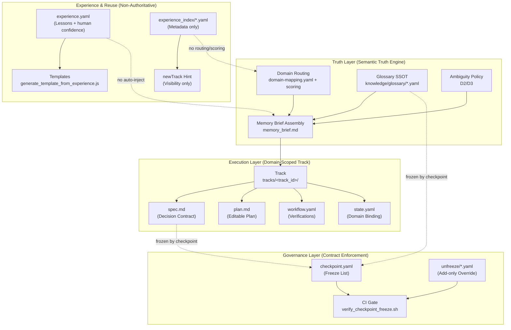

# LiYe OS Core — STABLE SPEC (v1.0)



## 1. Purpose

LiYe OS Core defines the minimum stable kernel that ensures:

- AI behavior is trackable
- Semantics are consistent
- Governance is enforceable
- Experience is visible but non-authoritative
- The system remains evolvable without corruption

**This spec is a contract, not a guide.**

## 2. Core Philosophy

- **Track is an execution container**, not a knowledge base.
- **Memory is semantic truth**, not a process engine.
- **Experience is visibility**, not authority.
- **Checkpoint freeze enforces responsibility**, not correctness.

## 3. Core Components (STABLE)

The following components constitute the stable kernel:

### 3.1 Track System (Execution Container)

Required Track structure:

```
tracks/<track_id>/
  spec.md
  plan.md
  state.yaml
  workflow.yaml
  checkpoint.yaml
  experience.yaml
```

**Invariants:**

- One Track binds to exactly one domain
- `spec.md` and `glossary` are governed by freeze/unfreeze
- `plan`/`workflow`/`experience` remain editable unless explicitly frozen in future versions

### 3.2 Memory Core (Semantic Truth Engine)

**Core responsibilities:**

- Domain routing (keyword scoring)
- Glossary SSOT (versioned definitions)
- Ambiguity policy (D2/D3)
- `memory_brief` assembly (context compression)

**Non-goals:**

- Memory must NOT become a workflow engine
- Memory must NOT be polluted by experience content

### 3.3 Experience Layer (Optional, Non-Authoritative)

- `experience.yaml` stores structured lessons and human confidence
- `experience_index` stores metadata only
- Experience never affects routing/scoring
- Experience never injects into `memory_brief` automatically

### 3.4 Governance Core (Contract Enforcement)

- `checkpoint.yaml` defines frozen files
- `verify_checkpoint_freeze.sh` enforces hard-fail on CI
- Unfreeze declarations enable controlled change with audit trail

## 4. Stability Boundaries (What MUST NOT Change)

The following are core contracts and must not be altered without a MAJOR bump:

### 4.1 Contract: Domain-Scoped Track

- Track ↔ domain binding is mandatory
- Track cannot span multiple domains

### 4.2 Contract: Glossary as SSOT

- Glossary remains the only place for definitions
- Experience cannot write into glossary

### 4.3 Contract: Freeze/Unfreeze

- Frozen files cannot be modified without an unfreeze declaration
- Unfreeze declarations are add-only and auditable

### 4.4 Contract: Experience Non-Authority

- Experience cannot influence scoring
- Experience cannot auto-inject into runtime context

## 5. Allowed Evolution (What MAY Change)

The following changes are allowed under STABLE rules:

- ✅ Add new domains (domain-mapping + glossary)
- ✅ Add new tracks under existing rules
- ✅ Add new experience files + index entries
- ✅ Improve audit scripts without weakening enforcement
- ✅ Add templates (structural only)
- ✅ Add optional tooling/CLI commands that do not alter contracts

## 6. Change Control

### 6.1 PATCH (Allowed anytime)

- Doc clarifications
- Tooling UX improvements
- Bug fixes that do not change contracts

### 6.2 MINOR (≤ 6 months cadence)

- Add new optional capabilities that do not change invariants
- Add new verification steps (stricter is OK)

### 6.3 MAJOR (Blocked unless explicitly approved)

- Any change to core contracts (Section 4)
- Any change that alters routing/scoring semantics
- Any change that allows experience to become authoritative

## 7. Governance References

- [TRACK_SCHEMA.md](./TRACK_SCHEMA.md)
- [TRACK_TEMPLATE_SCHEMA.md](./TRACK_TEMPLATE_SCHEMA.md)
- [UNFREEZE_SCHEMA.md](../governance/UNFREEZE_SCHEMA.md)
- [CHECKPOINT_OVERRIDE_POLICY.md](../governance/CHECKPOINT_OVERRIDE_POLICY.md)

## 8. Operating Principle

> **Core is stable. Growth happens through new tracks, not kernel rewrites.**
