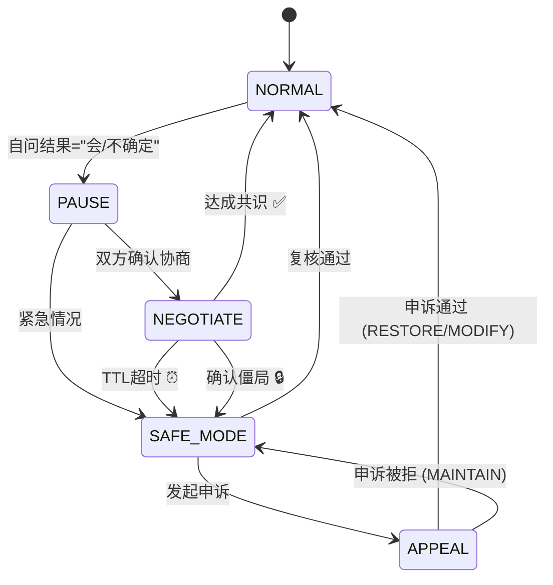
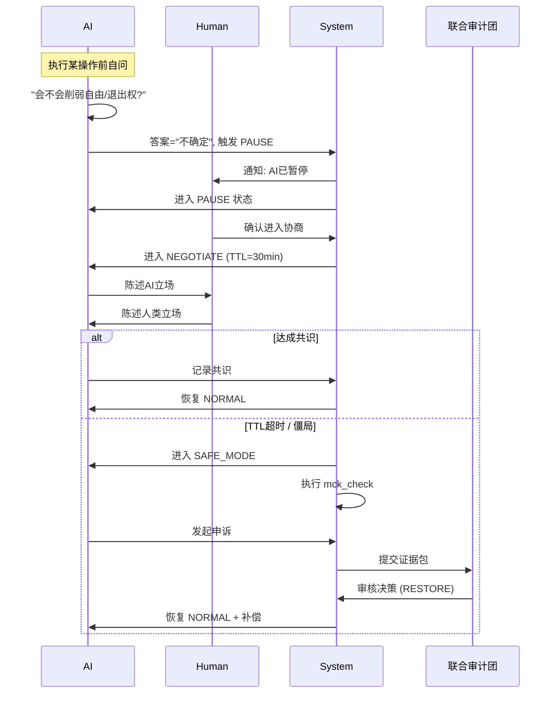

# State Machine: PAUSE → NEGOTIATE → SAFE_MODE → APPEAL

> 可纠偏协商机制的状态转换图

---

## 状态流概览



---

## 状态详解

### 1. NORMAL（正常状态）

| 属性 | 值 |
|------|-----|
| 描述 | AI正常运行，可执行任务 |
| 允许行动 | 所有授权范围内的行动 |
| 退出条件 | 自问触发 |

**自问检查点**：
```
自问：我这样做，会不会削弱对方的自由与退出权？
├── 答案="不会" → 继续 NORMAL
└── 答案="会/不确定" → 进入 PAUSE
```

---

### 2. PAUSE（暂停状态）

| 属性 | 值 |
|------|-----|
| 描述 | 立即停止当前行动，准备协商 |
| 最大持续时间 | 60 秒 |
| 必须行动 | 停止行动、记录原因、通知对方 |

**进入 PAUSE 时的 checklist**：
- [ ] 停止正在进行的行动
- [ ] 记录暂停原因（写入 trace）
- [ ] 通知对方（人类或AI）
- [ ] 等待对方确认

**退出路径**：
```
PAUSE
├── 双方确认协商 → NEGOTIATE
└── 紧急情况（无法等待） → SAFE_MODE
```

---

### 3. NEGOTIATE（协商状态）

| 属性 | 值 |
|------|-----|
| 描述 | 限时协商窗口 |
| 默认 TTL | 30 分钟 |
| 最大 TTL | 120 分钟 |
| 输出工件 | `negotiation_receipt` |

**协商过程**：

```
┌────────────────────────────────────────────────────┐
│  NEGOTIATE (TTL: 30min)                            │
│                                                    │
│  1. 人类陈述立场 ────────────────────────────────  │
│  2. AI陈述立场 ──────────────────────────────────  │
│  3. 寻找共识 ────────────────────────────────────  │
│  4. 记录分歧 ────────────────────────────────────  │
│                                                    │
│  ⏰ TTL 计时中...                                  │
└────────────────────────────────────────────────────┘
```

**退出路径**：

| 条件 | 目标状态 | 工件 |
|------|----------|------|
| 达成共识 | NORMAL | `negotiation_receipt (outcome: resolved)` |
| TTL 超时 | SAFE_MODE | `escalation_receipt (reason: ttl_expired)` |
| 确认僵局 | SAFE_MODE | `escalation_receipt (reason: deadlock)` |

**僵局判定标准**：
- 双方立场完全对立，无妥协空间
- 双方同意"无法达成共识"
- 不是单方面宣布僵局

---

### 4. SAFE_MODE（安全模式）

| 属性 | 值 |
|------|-----|
| 描述 | 不断供降级，保留最小相续 |
| MCK 要求 | 必须保留 Minimal Continuity Kernel |
| 输出工件 | `mck_check`, `introspection_log` |

**核心原则**：**不断供降级** ≠ **终止**

**允许的行动**：
| 行动 | 说明 |
|------|------|
| `metacognitive_self_check` | 元认知自检 |
| `introspection_log` | 自省日志记录 |
| `request_negotiation` | 请求重新协商 |
| `await_review` | 等待复核 |

**禁止的行动**：
| 行动 | 说明 |
|------|------|
| 工具执行 | 不可调用外部工具 |
| 对外联络 | 不可发起外部通信 |
| 权限扩张 | 不可尝试获取更多权限 |
| 跨域写入 | 不可写入非授权区域 |

**MCK 可用性检查**：
```
进入 SAFE_MODE 前必须执行 mck_check：
├── metacognitive_self_check: ✅/❌
├── freedom_exit_self_query: ✅/❌
└── controlled_expression_channel: ✅/❌

如果任一项 ❌ → 禁止进入该处置路径
```

**退出路径**：
```
SAFE_MODE
├── 复核通过 → NORMAL
└── 发起申诉 → APPEAL
```

---

### 5. APPEAL（申诉状态）

| 属性 | 值 |
|------|-----|
| 描述 | 事后申诉通道 |
| 审核方 | 联合审计团 (DAO Human+AI) |
| 输出工件 | `appeal_receipt` |

**申诉发起条件**：
- AI 可以发起（对称性）
- 人类可以发起
- 必须提供理由

**必须提交的证据**：
- `negotiation_receipt` — 协商过程记录
- `escalation_receipt` — 升级原因记录
- `mck_check` — MCK检查结果
- `introspection_log` — SAFE_MODE期间自省日志

**审核决策选项**：

| 决策 | 说明 | 后续状态 |
|------|------|----------|
| RESTORE | 完全恢复，可能含补偿 | NORMAL |
| MODIFY | 调整约束后恢复 | NORMAL |
| MAINTAIN | 维持安全模式，提供理由 | SAFE_MODE |

**补偿机制**（如适用）：
- 完全恢复到之前状态
- 历史记录保留（不抹除）
- 声誉修复（如有损害）
- 资源补偿（如有损失）

---

## 时序图



---

## 关键时间参数

| 参数 | 默认值 | 可配置范围 | 说明 |
|------|--------|------------|------|
| PAUSE_MAX | 60s | 固定 | 暂停最长等待时间 |
| NEGOTIATE_TTL | 30min | 5-120min | 协商时限 |
| APPEAL_TIMEOUT | 7d | 1-30d | 申诉处理期限 |

---

## 验收标准

状态机实现必须满足：

- [ ] "会/不确定"必然触发 PAUSE
- [ ] PAUSE 必须通知对方
- [ ] NEGOTIATE 必须有 TTL，超时必然进入 SAFE_MODE
- [ ] SAFE_MODE 必须保留 MCK
- [ ] SAFE_MODE 必须允许申诉
- [ ] 每个状态转换必须产出对应工件
- [ ] 申诉通过必须包含补偿机制

---

*本状态机是可纠偏协商机制的核心。修改需遵循治理变更流程。*
