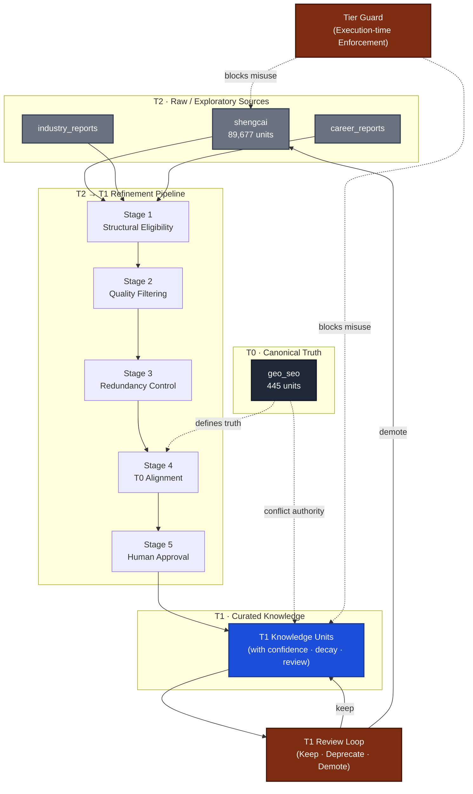

# Truth Source Governance Architecture

This diagram illustrates how GEO OS enforces knowledge quality **before ingestion**,
using tiered truth sources, guards, refinement pipelines, and review loops.

---

## Mermaid Diagram

---

## Legend

| Color | Tier | Description |
|-------|------|-------------|
| ⬛ Dark | T0 | Canonical Truth (frozen, authoritative) |
| 🔵 Blue | T1 | Curated Knowledge (with decay & review) |
| ⬜ Gray | T2 | Raw/Exploratory (needs refinement) |
| 🟤 Brown | Guard | Enforcement gates |

---

## Key Flows

1. **T2 → Pipeline → T1**: Raw sources must pass 5-stage refinement
2. **T0 → T1 Alignment**: T1 must not contradict T0 definitions
3. **T1 Review Loop**: Curated knowledge decays and requires periodic review
4. **Tier Guard**: Blocks unauthorized access at execution time
